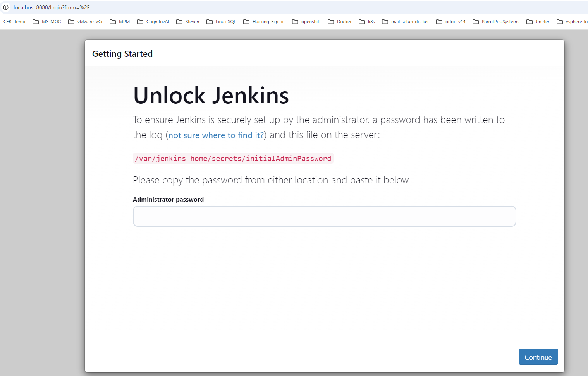
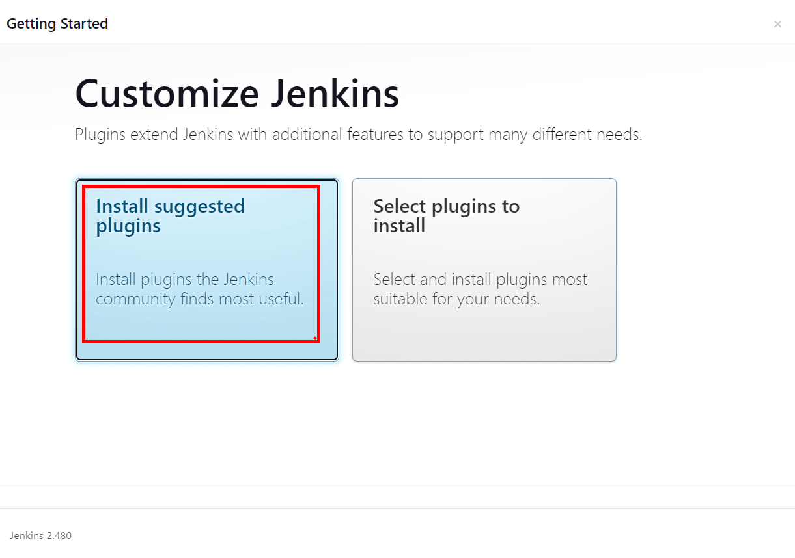
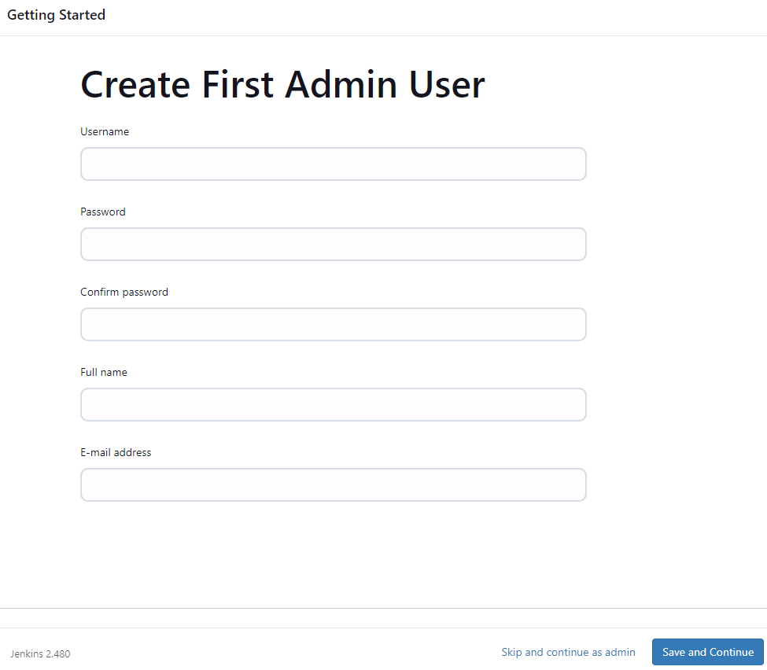

# Exercise 1: Jenkins UP

In this exercise, we'll learn to work with Jenkins.

To accomplish this, we'll build Jenkins Container and Run Jenkins container using docker-compose.

### Setup Jenkins containers

Run the following command to verify you don't have jenkins container image
```sh 
docker images 
```

Using this directory, build a new container which will run our Jenkins Server
```sh 
docker build -t myjenkins-blueocean:v3 . 
```

after the build is completed, verify you have the container images
```sh 
docker images 
```

Create jenkins network for the docker-compose
```sh
docker network create jenkins 
```

once the image is listed, we will bring up the container using docker-compose
```sh 
docker-compose up -d
```

Verify the container is running 
```sh
docker-compose ps 
```

Capture the admin password from the docker-compose logs
```sh 
docker-compose logs
```
The password would look like this: 


### Setup Jenkins: 
1. Open a Web Browser ( Chrome ) to http://localhost:8080 


2. in the Administrator password, enter the password you captured earlier

3. In the following screen, select Install Suggested plugins: 


4. Wait until jenkins installed and configured


5. In the following screen, create your user account and save and continue ( Remember your user account and password )


6. In the instance configuration, leave the default, hit Save and Finish


7. Hit Start using Jenkins


# END OF EXERCISE 1 - Jenkins UP